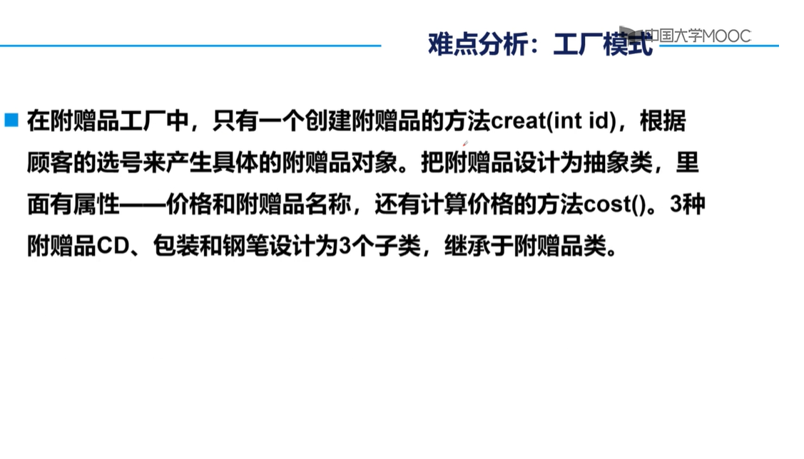

## 超市信息管理系统（二）

本次：**业务逻辑**

续上数据库连接。

## 目录

[TOC]


### 增删改查和业务

有些接口只完成基本的增删改查，而有些则通过上处的接口方法，实现逻辑业务。

#### 举例

增加一种货物，或者进口一种货品。

后者需要在 `进口记录` 上登记，设置数量A，再增加货品的数量C。

前者也要登记，设置数量A，再新增全新的货品，并设置它的数量C。


撤除一种货品。（在商品数量C的范围内）

需要新增一条撤除记录，设置数量O为撤除数量，再减少货品的数量C。


变更货品的其他属性。

如：name 和 type

可以直接变更，不用管关联的商品，商品记录，进口撤除……

它们是描述性属性。


### 三层原则

> UI，BI，DAO
>
> 表示层，业务逻辑层，数据访问层
>
> 数据访问层使用DAO 模式。
>
> 实体类、接口、实现类。
>
> ### 提交结果
>
> 数据库脚本文件（SQL），**系统类图**，程序代码
>
> ### 难点
>
> 确立实体、联系。
>
> 用类图设计系统，类如何抽象，怎么继承
>
> ### 计划
>
> 第一步
>
> 
>
> 第二步
>
> 采用面向接口的设计思想。
>
> 数据访问的各种操作，整理分类成各种接口。
>
> 让连接关闭数据库的操作，成为一个类。
>
> 
>
> 第三步
>
> 第四步
>
> 优化业务，
>
> 接口的进一步抽象：**单一职能原则**
>
> 优点：职能专一，容易替换
>
> 

### 界面功能

分析

登录一个用户，是顾客有不同的VIP，功能和数据有所不同。

是超市管理员，则连界面都不同。

#### 事件响应

在UI上的任何操作，都以事件响应为入口。

之后我们的程序，开始运行，最后返回交互结果。

#### 服务入口

监听器直接调用一个功能方法，得到结果数据，再下一步。

功能方法，将取决于事件？

或者？

没有逻辑和规则的增删改查

基本的完整的逻辑，所有业务

业务的划分，给不同的情形，不同的需求者

于是，不同的用户有了专门的服务。

#### 业务划分

按角色来划分，角色是登录用户的身份，包括未登录的游客。

角色将拥有一个或几个权限，它们就是能调用的业务。

角色将是一个类。

一个用户进入UI后的控制方式

- 事件响应
- 用户被赋予的角色
- 两者都有

#### 参考

##### 用户、角色和权限


用户获得什么权限，是通过授予什么角色。

获得角色，即有了对应的权限。

权限由行为组成。

行为在实际中，表示成接口。


权限是抽象行为。

角色是真实的类，由各种权限组成。


图中的角色，由*拥有* 着注入后的权限。

角色使用注入的权限，作为其角色的行为。

角色这个类，通过对象来区分。

是否简便？


于是，用户再去注入一个角色。

由复杂的依赖注入，和多级调用。

用户A -> 角色A1 -> 权限1实现类

权限的实现类，再去调用全局业务类。

##### 启动、登录和菜单

操控一个用户对象。

在登录后，授权它角色（*多级依赖注入，角色和权限，都是临时创生的，非常麻烦* ）。

登录后。

看什么角色，进入什么界面。

进入有相应的功能服务。


#### 工厂与实体类

实体类不用到模式，而用类抽象的模式



+


具体的附赠品类，继承抽象的附赠品。

工厂应该不是继承它们3个。

工厂用来返回new 出来的附赠品。

工厂只能提取**实例创生** 的代码，适合底层，常变更的对象。

**暂时不需要改为这种模式。使用DAO模式**

#### 实体类的抽象

1. 定义Supermarket_Member抽象类，extends此类的类，都会有一个数据库物理id

#### 实体类的联系

1. Sale类的组成：Makeup重新定义
2. Makeup使用内部类
   1. 内部类问题：[(31条消息) 静态内部类(public static class)和普通内部类(public class)的区别_我是guyue，guyue就是我O(∩_∩)O-CSDN博客_内部类和普通类的区别](https://blog.csdn.net/guyue35/article/details/105114460)
3. Makeup将是一个商品所有组成成分
4. Makeup有它属于的Sale。
5. Makeup没有数据库物理id。


### 逻辑业务

**全部，全局，细小，抽象**

> ### 需求分析
>
> - 超市里有各色商品，同一类商品按品牌标价，所有商品都按单价出售。
>
> - 顾客进入商店后，可以查看商品，购买商品，查看以往记录。
>
> - 超市管理员，可以为商品定价，查看以往的定价情况，同时撤除一些商品，查看撤除的商品，从外进口一些商品，查看商品进口的情况。
>
> #### 详细描述
>
> 商品作为一个实体，其数量主要指正在出售的数量，即商品的总数，设为C。
>
> 每种商品进口时的数量，累加后是商品的最初数量，设为A。
>
> 商品被顾客购买的数量，累加后设为S。
>
> 则有， A = C + S
>
> 超市管理员查看商品，即看它当前的数量，总进口的数量和总出售的数量。
>
> 超市管理员撤除商品，仅减少它当前的数量。
>
> 超市管理员进口商品，增加A，和C。


#### 货品的业务

>进口货品
>
>查看货品进口记录
>
>查看超市所有进口记录
>
>查看超市所有货品
>
>搜索货品
>
>查看货品
>
>**遗弃货品**
>
>查看遗弃的货品
>
>**撤回遗弃的货品**
>
>修改货品其他
>
>​	*不能看或者撤回*
>
>**统计货品相关商品**
>
>**统计货品的购买情况**


#### 商品的业务

>新增商品
>
>查看超市所有商品
>
>查看指定商品
>
>搜索商品
>
>​	搜索某名称的商品
>
>​	搜索含某货品的商品
>
>​	搜索含某类型的货品的商品
>
>​	*以上即搜索某类商品*
>
>修改商品组合
>
>修改商品价格
>
>修改商品其他
>
>​	*三种修改可以看，但不能撤回*
>
>**统计商品的修改记录**
>
>**下架商品**
>
>查看下架的商品
>
>**撤回下架的商品**
>
>查看超市所有购买记录
>
>查看某天的购买记录
>
>**统计商品的购买情况**


#### 顾客的业务

>**购买商品**
>
>**统计以往的购买记录**
>
>**统计购买过的商品**
>
>注册
>
>修改名字
>
>修改密码
>
>**注销**
>
>**恢复注销的用户**


### 业务优化

通过接口抽象的方式。

接口，有指定的方法，参数和结果都固定。

#### 接口抽象

基本的，关键的，必要的方法。

- **不是共用方法**
- 会产生重复功能的抽象接口。
- **提取近似的方法**
- 节省方法设计，但他们的实现完全不同。


#### 近似可同源

> 近似是某种程度上的同源。
>
> 他们的共同点，抽象出一个超类。
>
> #### 增加
>
> **进口货品** 和 **新增商品**	
>
> - 前者会有数量可以没有类型，后者有且只有类型。
> - 都可以返回成功，状态量，或抛出异常。
> - 与物品的物理id无关
>
> 无提取。
>
> #### 删除
>
> **遗弃货品** 和 **下架商品**，以及顾客 **注销**
>
> - 都是对一个物品，有关物品的物理id
> - 具体的伪删除方式会不同
>
> 
>
> #### 查看，搜索，所有
>
> - 返回值不一样
> - 且超类只有物理id，无意义。
>
> 无提取。
>
> #### 统计
>
> - 统计的结果返回值，类型完全相同。
> - 返回商品集
>   - 货品：**统计货品相关商品**
>   - 商品：**统计商品的修改记录**
>   - 顾客：**统计购买过的商品**
> - 返回购买集
>   - 货品：**统计货品的购买情况**
>   - 商品：**统计商品的购买情况**
>   - 顾客：**统计以往的购买记录**
> - 传入参数，关键都是 id
> - 具体什么id，可以在方法实现上处理。
>
> #### 修改
>
> - 方法的入参，既要id，也要新内容
> - 目标不同类。
>
> 无提取。
>
> #### 撤回
>
> **撤回遗弃的货品**， **撤回下架的商品**，和**恢复注销的用户**
>
> - 都是指定id
> - 都可以返回成功，状态量，或抛出异常。
> - 都一定成功，返回空。
>
> 

### 角色权限

权限即可用的业务，这里的业务是具体的方法。

#### 划分权限问题

对货品的查看权限。

进口，管理权限。


对商品的购买权限

对商品的查看权限。

对商品的管理权限。


对顾客的查看权限

对顾客的管理权限


顾客的注册权限

顾客的登录权限

顾客的注销权限

以及一系列的：相关、针对性、统计权限。

#### 依据

- 顾客只能接触商品。
  - 顾客不能按货品搜索商品。
  - 能查看指定的，已下架商品。（被动显示已下架，不能主动看。**这些是更细致的处理** ）
- 超市管理员不能购买商品。

#### 策略

把已有的业务，逐一分配的各个角色上。

##### 附加想法

角色分配到不同的业务，不完全等于他们实际适合的权限。

> 因为没有权限层，同时更底层的逻辑和实体，仍具有某些缺陷。

在角色层上增加了临时的类，以约束权限，和拓展新的功能。


### 业务实现

#### 调用DAO层

[Mybatis执行sql（insert、update、delete）返回值问题 - 葬瞳飘血 - 博客园 (cnblogs.com)](https://www.cnblogs.com/ZTPX/p/10552512.html)

[[转载\]java中Statement详细用法 - humbird - 博客园 (cnblogs.com)](https://www.cnblogs.com/killer-xc/p/7941343.html)

##### DAO原则

尽量是单纯的sql命令，和值的简单转换。

返回值是类时，都要是新的对象。

【sql约束】数据库完整性的需要，在更改时检查。

除此以外DAO不检查异常。

#### 异常处理

[(31条消息) 什么是异常？为什么要抛出异常？throws和throw的区别_努力努力再努力²的博客-CSDN博客_throws和throw的区别](https://blog.csdn.net/weixin_44531966/article/details/109669231)

主动抛出，需要在方法体上显示声明，调用该方法的函数，需要显示地捕获，或继续抛出。

未显示声明，可不理会。

### 业务接口改动

#### 内部修改

GoodsBiz业务实现时，对接口内部有修改。


#### 继承修改

业务实现，需要抛出异常。

**后遗症：**

- 个别的抛出异常，绑定在父接口上。
- 之后可能要处理，许多不必要的抛出异常

**措施：**

1. 取消部分继承：GoodsBiz继承的Removable。
2. GoodsBiz增加forbid业务。
3. forbid细节不变，
4. 特别保留Removable的入参类型：Supermarket_Member。

#### ……

### 用户和角色

角色类，划分好业务后，在窗口类上加角色。

#### 依赖注入

手动注入：

- 在窗口类创建时。
- 同时new出所需的依赖。
- 通过有参构造方法限定。

窗口依赖：不同的角色实例

角色依赖：所有的业务类

业务依赖：所有的数据传输SQL类


## 前端交互

### 功能

展示所有商品，上架的。

搜索商品，通过商品名称。

登录已注册的顾客。

注册新顾客。

### 实现

#### 自定义对话框

最初的方法

```java
class registerRespond implements ActionListener{

        @Override
        public void actionPerformed(ActionEvent e) {
            RegisterResult registerResult = f(WelcomeJFrame.this, registerButton);
            System.out.println("监听到注册事件调用的f方法完成了！");
            System.out.println(registerResult);
        }

        RegisterResult f(Frame owner, Component parentComponent){
            JDialog dialog = new JDialog(owner, true);

            //Frame owner必要，parentComponent只是为了定位对话框。
            dialog.setBounds(new Rectangle(300,200));
            dialog.setLocationRelativeTo(parentComponent);
            dialog.setDefaultCloseOperation(WindowConstants.DISPOSE_ON_CLOSE);
            //对话框close不能做EXIT的动作。
            JLabel nameLabel = new JLabel();
            nameLabel.setText("称呼");
            JLabel pwdLabel = new JLabel();
            pwdLabel.setText("设置密码");
            JLabel pwdAgainLabel = new JLabel();
            pwdAgainLabel.setText("再输入一遍密码");
            final TextField nameTextField = new TextField(8);
            final TextField pwdTextField = new TextField(8);
            final TextField pwdAgainTextField = new TextField(8);
            //final用于匿名类的编译时绑定。
            JPanel p1 = new JPanel();
            JPanel p2 = new JPanel();
            JPanel p3 = new JPanel();
            Container p = dialog.getContentPane();
            p.setLayout(new GridLayout(4,1));
            p.add(p1);
            p.add(p2);
            p.add(p3);
            p1.setLayout(new FlowLayout());
            p2.setLayout(new FlowLayout());
            p3.setLayout(new FlowLayout());
            p1.add(nameLabel);
            p1.add(nameTextField);
            p2.add(pwdLabel);
            p2.add(pwdTextField);
            p3.add(pwdAgainLabel);
            p3.add(pwdAgainTextField);
            JButton commitButton = new JButton("提交");
            JButton cancelButton = new JButton("取消");
            JPanel p4 = new JPanel();
            p.add(p4);
            p4.setLayout(new FlowLayout());
            p4.add(commitButton);
            p4.add(cancelButton);
            RegisterResult registerResult = new RegisterResult();
            System.out.println("f方法进行到了组件事件监听器的环节！");
            commitButton.addActionListener(new ActionListener() {
                @Override
                public void actionPerformed(ActionEvent e) {
                    System.out.println(nameTextField.getText());
                    System.out.println(pwdTextField.getText());
                    System.out.println(pwdAgainTextField.getText());
                    dialog.dispose();
                    registerResult.registerName = nameTextField.getText();
                    registerResult.registerPwd = pwdTextField.getText();
                    registerResult.registerPwdAgain = pwdAgainTextField.getText();
                    System.out.println("对话框的监听器完成结果值注入！");
                }
            });
            System.out.println("1");
            dialog.setVisible(true);
            System.out.println("2");
            //测试结果证明，该方法中止在：对话框对象初始化好后，setVisible。
            //如果JDialog设置：modal=false，则不会为此中止。
            return registerResult;
        }
    }
```

之后设置了专门的类，发在window.dialog下。

定义了MyJOptionPane来封装自定义对话框。

**注意：MyJOptionPane类需要和其他对话框，放在同包内，以让对话框protected的结果被访问。**

### 游客页面


### 顾客页面

#### 商品购买

陈列商品。

搜索，显示商品。

购买商品。

退出。

进入个人主页。

## 代办

JComboBox增加对象作为item，现实的是其toString（）

使用继承Sale的子类，输出专门的toString();


## 想法

### 问题

内存中记录的customer登入身份的放置问题。

现在放在顾客角色类中。

顾客角色类，负责划分和调用业务。

多管理一个顾客登录记录，会破坏：**职能专一性原则**

### 方案

以后的依赖对象管理类中，加这个记录。


## 代办

顾客通过购买记录，搜索到的商品，可能是迭代品。

这时，方法调用会出错。

应该获取最新的商品，才能获取相关的迭代品。

解决方式：增加接口，业务……


## 想法

前端的数据调用的频率问题。

目标：一致性，实时性。

策略：最开始获取尽量多的数据，保留到内存的类中。在查找、临时不确定改动时，就使用这些数据。


#### 查看记录

#### 个人主页

呈现个人信息。

修改名称。

修改密码，需要输入原密码。

注销。

退出。

进入购买主页。

陈列购买记录。

搜索含某商品的购买记录。

查看商品现状。

继续购买商品。

#### 超市管理主页

##### 商品树

列出所有商品，附属的货品。**商品树**

##### 货品栏

独立列出所有货品。**货品栏**：货品，数量，状态。


##### 选中商品

当点击商品时，

1. 在货品栏标出其附属货品。
2. 显示组成信息
3. 冲突的货品，货品栏没有的。
4. 独立列出

**货品的状态**，与商品关联紧密。不管点击不点击商品栏都有一致的数据。

它有充足，缺货，遗弃。

充足和缺货，货品正常陈列。

遗弃，点击商品栏时才有，即上述的冲突。


点击商品同时，

1. 在另一些组件中显示商品，价格信息。
2. **侧边树** 如果不继续点其他商品，或超市，则保持显示。
3. 保持显示，可以在点货品时，重新排列的列出。


选中状态下点商品更改

1. 更改名称按钮
2. 更改价格按钮
3. 更改组成，
4. 通过主表上编辑文字的方式。响应时需要，行列和字符判断。


##### 未选中

未选中下，进行货品更改

1. 编辑名称，加响应处理。
2. 编辑类型，加响应处理。
3. 编辑数量，加分类处理。
4. 如果编辑范围越界，
5. 新建商品，需要各种满足判断。靠内存中存放的数据。

##### 删除和新建

###### 货品

**注：功能使用不经常**

直接在主表上实现删除新建的交互。

需要多条件判断。


###### 商品

删除通过，选中再按钮的方式。

新建，特殊键，选中一个临时设定的空商品，通过已有的组件设置信息，添加货品。


#### 思路

前端功能挖掘的思路：

有实体数据，就能显示。能显示，就有修改。

修改的临界，则是删除。

有了删除，也应该有新建。

有这些变动，会考虑记录的显示。


数据交互和传输小做法：

设置数据存储体，对应各个复杂组件上，在内存中方便管理数据。

确定更新的强度和时间。
