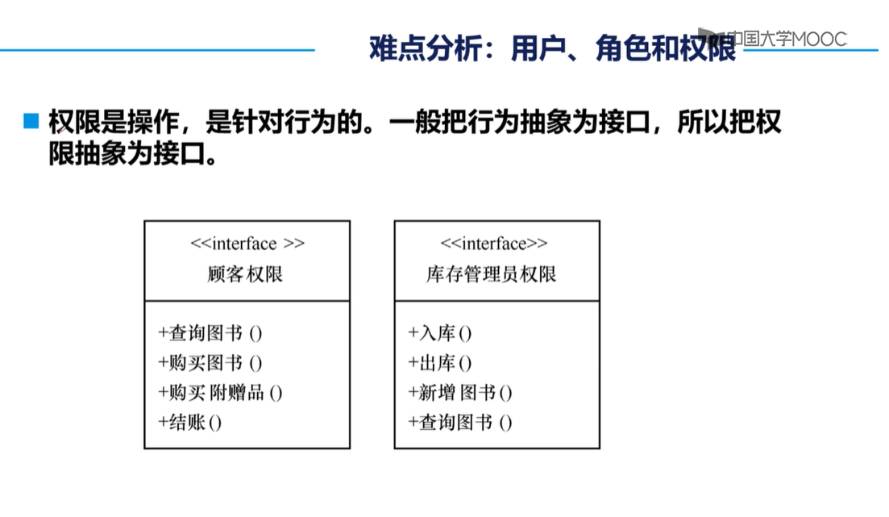
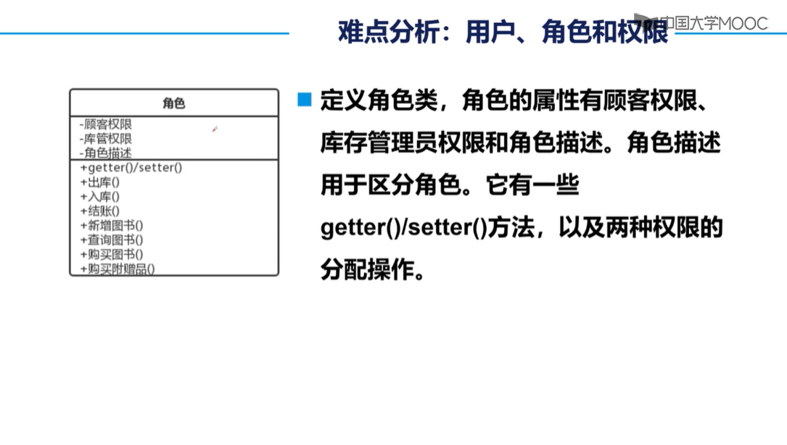
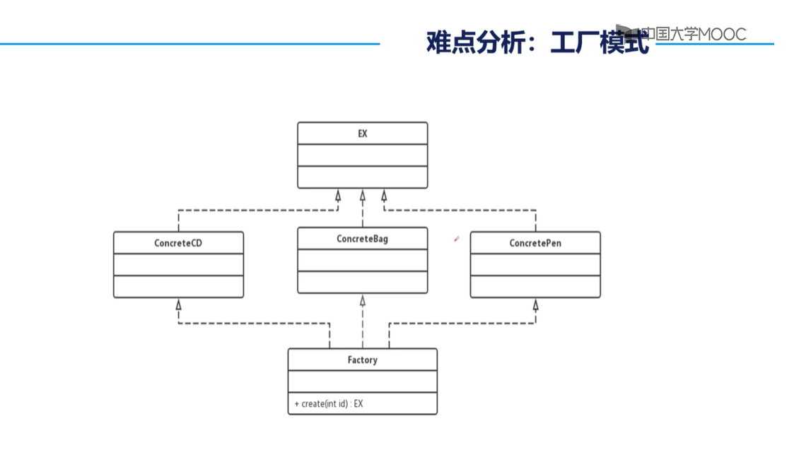

### 超市信息管理系统

对于几个、多个商品：

- 顾客在登录后购买
- 顾客未登录下购买的区别

购买行为：使商品被标记卖走

### 实体

#### 商品 

属性：

- 从哪里来，现在的数量，商品的去向

#### 资金账单

属性：

- 时间，交易明细，收款，余额

---

不设账单

## 目录

[TOC]


### 需求分析

- 超市里有各色商品，同一类商品按品牌标价，所有商品都按单价出售。

- 顾客进入商店后，可以查看商品，购买商品，查看以往记录。

- 超市管理员，可以为商品定价，查看以往的定价情况，同时撤除一些商品，查看撤除的商品，从外进口一些商品，查看商品进口的情况。

#### 详细描述

商品作为一个实体，其数量主要指正在出售的数量，即商品的总数，设为C。

每种商品进口时的数量，累加后是商品的最初数量，设为A。

商品被顾客购买的数量，累加后设为S。

则有， A = C + S

超市管理员查看商品，即看它当前的数量，总进口的数量和总出售的数量。

超市管理员撤除商品，仅减少它当前的数量。

超市管理员进口商品，增加A，和C。

#### 价格问题

因为顾客购买商品，直接按标价，超市管理员在进口商品时，只论数量，价格只是商品的一个可变属性。

而当超市采用多种营销模式，出售商品时，价格就独立于商品。价格和多个商品，甚至客户关联。


| 商品1 | 商品2 | 商品3 | 商品4 | 价格 |
| :---- | :---- | ----- | ----- | ---- |
| 1     | 0     | 0     | 0     | ￥   |
| 0     | 1     | 0     | 0     | ￥   |
| 0     | 2     | 0     | 0     | ￥   |
| 0     | 2     | 1     | 1     | ￥   |
|       |       |       |       |      |

Er图上的含义： 


**原来的商品，去掉价值属性后，变成了货品。**

一种货品会被包装在不同的商品中

一种商品可能含有多个，多种货品。

**份数：一种商品包含某货品的数量。**设为N

商品只有种类，**没有数量。**


### 概念模型

#### 纠正后

原来商品被购买的数量：S

现在是货品的集合，商品的销售数量。S


---

#### 增设

> 超市管理员撤除商品，仅减少它当前的数量。

即商品（指货品，下同）还有一个去向，反映在它的数量一致性上。

撤除，即遗弃。

一个商品可以有多次遗弃，一次遗弃记录了某一商品什么时候遗弃，撤下了多少。


#### 第三去向

遗弃，货品直接被指认不再使用。

上处的遗弃，实际是撤下。

纠正后：

- 遗弃通过伪删除标志
- 撤下是记录remove表。

需求上：

- 撤下不用遗弃，仍可见。
- 遗弃后不可见，消失。
- 遗弃一定记录，全数撤除。

### 关系模式

货品（**货品ID**，名称，类型，数量C） 

商品（**商品ID**，商品名称，价格）  

顾客（**顾客ID**，姓名，密码，VIP） 

---

供货（**供货ID**，*货品外键*，进口时间，数量A）

包含（***货品外键，商品外键***，份数N）

购买（**购买ID**，*商品外键，顾客外键*，购买日期，数量S）

撤除（**撤除ID**，*货品外键*，撤除时间，数量O）

---

#### 属性

包含和购买，都是为了多对多的联系而独立出的实体。

包含和购买的属性，前者只记录：某商品含有某货品多少。后者要记录：某顾客在某一次，购买了某商品多少。

购买的实体完整性，涉及到了某一次活动，可设置次数的属性。但这里直接用：物理ID区分前后。


### 建表SQL Server

- create 模式
- 完整性——实体，参照，主外键
- 属性上约束——数据类型，非空，可空，唯一，取值check

#### 笔记

##### SQL Server Manager 使用

[(31条消息) SQLserver——Sqlserver的使用_ZoJane的博客-CSDN博客_sqlserver使用](https://blog.csdn.net/qq_35706707/article/details/102527735)

[SQLServer 不允许保存更改错误解决办法 - springsnow - 博客园 (cnblogs.com)](https://www.cnblogs.com/springsnow/p/13219909.html)

软件的操作，sql的写法：

##### 主键自增

[SQLServer数据库添加主键和主键自增-百度经验 (baidu.com)](https://jingyan.baidu.com/article/91f5db1b11dda21c7f05e3d3.html)

可以间主键自增，在MSSM里叫：标识、增量、种子

##### 设置unique

[sqlserver表的唯一键约束怎么设置？_百度知道 (baidu.com)](https://zhidao.baidu.com/question/42497731.html)

可以给两个、多个属性类加：unique(  , ...)

```sql
alter table goods
add constraint C2 unique(goods_name,goods_type)
```

测试结果

+

---

##### 约束、设置外键

[(31条消息) SqlServer基础：约束_weixin_30407099的博客-CSDN博客](https://blog.csdn.net/weixin_30407099/article/details/98411748)

[(31条消息) SQL server 外键约束操作_烟敛寒林的博客-CSDN博客_sqlserver外键约束怎么写](https://blog.csdn.net/dyw_666666/article/details/88794126)

注意设置外键 —— 参照完整性？级联删除：不执行删除


### 关系模式 - 细节

#### 实体

##### 货品

货品（**货品ID**，名称，类型，数量C） 

> goods(goods_id, goods_name, goods_type, number_c, logout)

- goods_id：主键，整型，自增
- （goods_name, goods_type）：唯一，varchar，引索
- number_c：整型
- logout：整型，默认0，check(0,1)
  0. 货品正常和买完
  1. 撤下伪删除

##### 商品

商品（**商品ID**，商品名称，价格，删除标志）

> sale(sale_id, sale_name, sale_price, sale_pid, logout)

- sale_id：主键，整型，自增

- sale_name：不唯一，varchar

- sale_price：小数，decimal，check(>=0)

- logout：整型，默认0，check(0,1)

  1：下架伪删除

- sale_pid：参照sale_id主键，可空。

  - 设计
    - 直接参照新代商品id，一对多模式。
    - 不用一对一，因为迭代更新次序，可通过物理自增id反映。
    - sale_pid不为空时是迭代品，迭代品一定下架。
    - check【(sale_pid is null ) or ( (sale_pid is not null ) and ( logout = 1 ) )】
  - 约束
    - sale_pid依赖sale_id
    - sale_pid可以是null
    - 被依赖的商品的sale_pid==null
    - sale_pid非空的商品，其logout==1
  - 实现（对应上面）
    - 外键：sale_pid参照sale_id
    - 默认：null
    - *无法实现*，**只能在sql更改时检查，可以抛异常**
    - check语句


##### 顾客


顾客（**顾客ID**，姓名，密码，VIP，删除标志） 

> customer(customer_id, customer_name，customer_pwd, customer_vip, logout)

- customer_id：主键，整型，自增
- customer_name：唯一，varchar
- customer_pwd：非空，varchar，check(len(?) = 6)
- customer_vip：整型，默认0，check(0~3)
- logout：整型，默认0，check(0,1)


#### 联系

##### 供货

供货（**供货ID**，*货品外键*，进口时间，数量A）

>  import(import_id, goods_id, import_date, number_a)

- import_id：主键，整型，自增
- goods_id：外键，整型，foreign key (?) reference goods(?)
- import_date：日期到秒，datetime，可空
- number_a：整型

##### 包含

包含（***货品外键，商品外键***，份数N）

> makeup(goods_id, sale_id, number_n)

- goods_id：外键，整型，reference goods(?)
- sale_id：外键，整型，reference sale(?)
- (goods_id, sale_id)：主键
- number_n：整型

##### 购买

购买（**购买ID**，*商品外键，顾客外键*，购买日期，数量S）

> purchase(purchase_id, goods_id, customer_id, customer_date, number_s)

- purchase_id：主键，整型，自增
- goods_id：外键，整型，reference goods(?)
- customer_id：外键，整型，reference customer(?)
- customer_date：可空，datetime
- number_s：整型

##### 撤除

撤除（**撤除ID**，*货品外键*，撤除时间，数量O）

> remove(remove_id, goods_id, remove_date, number_o)

- remove_id：主键，整型，自增
- goods_id：外键，整型，reference goods(?)
- remove_date：日期到秒，datetime，可空
- number_o：整型


#### 一系类改动

第一次：

第二次：顾客密码

第三次：伪删除，货品数量C

第四次：商品修改，和下架两种伪删除

第五次：购买记录增加日期

第六次：货品加logout换C，做伪删除

第七次：商品增加pid，下架变回一种。


#### 更新时间：2021/12/27

**持续更新中**


## 疑问

## 考虑商品，是否增加售完标识？

在将临时类。

数据再次处理靠定义新类完成。

新类可封装原来的实体类。原类的转换，新类的创建可依靠工厂模式。


#### 补充知识

中午时，得到的建议，在项目中用到，数据库概论上不讲。

> - 不必设置外键
> - 物理ID作为主键，逻辑ID作为唯一标识。方便查找？
> - 不要delete记录，伪删除！


#### 伪删除 ：

伪删除的必要。

举例：

如果某种货品被全部撤除，它被表中消失，则参照它级联实体都会出错。

所以撤除、购买行为让货品数量C变为0时，不移除该商品，用0做伪删除。

之后的查表，会看到该种货品数量为0，商品判断未缺货，顾客购买记录不影响。

##### 1.顾客

顾客的伪删除，顾客实体增加属性：注销状态  。

**设删除标志属性**

> off：0，正常，1，已注销。

##### 2.商品

商品同样不能直接删除，因为会影响购买记录。

同时，商品组合方式修改，等于新增一种商品，伪删除原来的商品，购买记录不变。

**设删除标志属性**

> off：0，正常，1，已注销。

***具体看关系模式 - 细节***

###### 增加

商品被取代的现上架商品。

被取代的商品一定下架，它将拥有一个 **现使用商品的id。**

主动下架的商品，即停止更新，不再有 **现使用商品的id。**

- 现使用商品的id，主要是为了 获取一个商品更新组。

- 现使用商品，即更新组中为首的商品，无论是否下架。
  - 它的**现使用商品的id** 为无。
  - 新代：现使用商品，无论是否下架。
  - 迭代：现使用商品关联的，已被取代的商品，一定已下架。
- *目前的关系模式无法将商品更新组关联*


##### 3.货品

货品伪删除，是将其数量C 变为0。

**也使用标志**


#### 新增需求

##### 分析

已注销的顾客，不能再登录。

但仍保留着：它唯一的名称，它的vip等级。

直到超市管理员，取消该顾客的注销。


伪删除的商品，仍在顾客的购买记录中可见。

陈列的是替换后的商品，新的商品id。


### 连接数据库

驱动，connect，statement，sql

#### 导入jar包

[(31条消息) add as library是什么？有什么用？如何打开？_doubleguy的博客-CSDN博客_add as library](https://blog.csdn.net/doubleguy/article/details/104947149)

#### ……


### 增删改查和业务

有些接口只完成基本的增删改查，而有些则通过上处的接口方法，实现逻辑业务。

#### 举例

增加一种货物，或者进口一种货品。

后者需要在 `进口记录` 上登记，设置数量A，再增加货品的数量C。

前者也要登记，设置数量A，再新增全新的货品，并设置它的数量C。


撤除一种货品。（在商品数量C的范围内）

需要新增一条撤除记录，设置数量O为撤除数量，再减少货品的数量C。


变更货品的其他属性。

如：name 和 type

可以直接变更，不用管关联的商品，商品记录，进口撤除……

它们是描述性属性。


### 三层原则

> UI，BI，DAO
> 
> 表示层，业务逻辑层，数据访问层
> 
> 数据访问层使用DAO 模式。
> 
> 实体类、接口、实现类。
> 
> ### 提交结果
> 
> 数据库脚本文件（SQL），**系统类图**，程序代码
> 
> ### 难点
> 
> 确立实体、联系。
> 
> 用类图设计系统，类如何抽象，怎么继承
> 
> ### 计划
> 
> 第一步
> 
> 
> 
> 第二步
> 
> 采用面向接口的设计思想。
> 
> 数据访问的各种操作，整理分类成各种接口。
> 
> 让连接关闭数据库的操作，成为一个类。
> 
> 
> 
> 第三步
> 
> 第四步
> 
> 优化业务，
> 
> 接口的进一步抽象：**单一职能原则**
> 
> 优点：职能专一，容易替换
> 
> 

### 界面功能

分析

登录一个用户，是顾客有不同的VIP，功能和数据有所不同。

是超市管理员，则连界面都不同。

#### 事件响应

在UI上的任何操作，都以事件响应为入口。

之后我们的程序，开始运行，最后返回交互结果。

#### 服务入口

监听器直接调用一个功能方法，得到结果数据，再下一步。

功能方法，将取决于事件？

或者？

没有逻辑和规则的增删改查

基本的完整的逻辑，所有业务

业务的划分，给不同的情形，不同的需求者

于是，不同的用户有了专门的服务。

#### 业务划分

按角色来划分，角色是登录用户的身份，包括未登录的游客。

角色将拥有一个或几个权限，它们就是能调用的业务。

角色将是一个类。

一个用户进入UI后的控制方式

- 事件响应
- 用户被赋予的角色
- 两者都有

#### 参考

##### 用户、角色和权限


用户获得什么权限，是通过授予什么角色。

获得角色，即有了对应的权限。

权限由行为组成。

行为在实际中，表示成接口。



权限是抽象行为。

角色是真实的类，由各种权限组成。



图中的角色，由*拥有* 着注入后的权限。

角色使用注入的权限，作为其角色的行为。

角色这个类，通过对象来区分。

是否简便？


于是，用户再去注入一个角色。

由复杂的依赖注入，和多级调用。

用户A -> 角色A1 -> 权限1实现类

权限的实现类，再去调用全局业务类。

##### 启动、登录和菜单

操控一个用户对象。

在登录后，授权它角色（*多级依赖注入，角色和权限，都是临时创生的，非常麻烦* ）。

登录后。

看什么角色，进入什么界面。

进入有相应的功能服务。


#### 工厂与实体类

实体类不用到模式，而用类抽象的模式


+



具体的附赠品类，继承抽象的附赠品。

工厂应该不是继承它们3个。

工厂用来返回new 出来的附赠品。

工厂只能提取**实例创生** 的代码，适合底层，常变更的对象。

**暂时不需要改为这种模式。使用DAO模式**

#### 实体类的抽象

1. 定义Supermarket_Member抽象类，extends此类的类，都会有一个数据库物理id

#### 实体类的联系

1. Sale类的组成：Makeup重新定义
2. Makeup使用内部类
   1. 内部类问题：[(31条消息) 静态内部类(public static class)和普通内部类(public class)的区别_我是guyue，guyue就是我O(∩_∩)O-CSDN博客_内部类和普通类的区别](https://blog.csdn.net/guyue35/article/details/105114460)
3. Makeup将是一个商品所有组成成分
4. Makeup有它属于的Sale。
5. Makeup没有数据库物理id。


### 逻辑业务

**全部，全局，细小，抽象**

> ### 需求分析
>
> - 超市里有各色商品，同一类商品按品牌标价，所有商品都按单价出售。
>
> - 顾客进入商店后，可以查看商品，购买商品，查看以往记录。
>
> - 超市管理员，可以为商品定价，查看以往的定价情况，同时撤除一些商品，查看撤除的商品，从外进口一些商品，查看商品进口的情况。
>
> #### 详细描述
>
> 商品作为一个实体，其数量主要指正在出售的数量，即商品的总数，设为C。
>
> 每种商品进口时的数量，累加后是商品的最初数量，设为A。
>
> 商品被顾客购买的数量，累加后设为S。
>
> 则有， A = C + S
>
> 超市管理员查看商品，即看它当前的数量，总进口的数量和总出售的数量。
>
> 超市管理员撤除商品，仅减少它当前的数量。
>
> 超市管理员进口商品，增加A，和C。


#### 货品的业务

>进口货品
>
>查看货品进口记录
>
>查看超市所有进口记录
>
>查看超市所有货品
>
>搜索货品
>
>查看货品
>
>**遗弃货品**
>
>查看遗弃的货品
>
>**撤回遗弃的货品**
>
>修改货品其他
>
>​	*不能看或者撤回*
>
>**统计货品相关商品**
>
>**统计货品的购买情况**


#### 商品的业务

>新增商品
>
>查看超市所有商品
>
>查看指定商品
>
>搜索商品
>
>​	搜索某名称的商品
>
>​	搜索含某货品的商品
>
>​	搜索含某类型的货品的商品
>
>​	*以上即搜索某类商品*
>
>修改商品组合
>
>修改商品价格
>
>修改商品其他
>
>​	*三种修改可以看，但不能撤回*
>
>**统计商品的修改记录**
>
>**下架商品**
>
>查看下架的商品
>
>**撤回下架的商品**
>
>查看超市所有购买记录
>
>查看某天的购买记录
>
>**统计商品的购买情况**


#### 顾客的业务

>**购买商品**
>
>**统计以往的购买记录**
>
>**统计购买过的商品**
>
>注册
>
>修改名字
>
>修改密码
>
>**注销**
>
>**恢复注销的用户**


### 业务优化

通过接口抽象的方式。

接口，有指定的方法，参数和结果都固定。

#### 接口抽象

基本的，关键的，必要的方法。

- **不是共用方法**
- 会产生重复功能的抽象接口。
- **提取近似的方法**
- 节省方法设计，但他们的实现完全不同。


#### 近似可同源

> 近似是某种程度上的同源。
>
> 他们的共同点，抽象出一个超类。
>
> #### 增加
>
> **进口货品** 和 **新增商品**	
>
> - 前者会有数量可以没有类型，后者有且只有类型。
> - 都可以返回成功，状态量，或抛出异常。
> - 与物品的物理id无关
>
> 无提取。
>
> #### 删除
>
> **遗弃货品** 和 **下架商品**，以及顾客 **注销**
>
> - 都是对一个物品，有关物品的物理id
> - 具体的伪删除方式会不同
>
> 
>
> #### 查看，搜索，所有
>
> - 返回值不一样
> - 且超类只有物理id，无意义。
>
> 无提取。
>
> #### 统计
>
> - 统计的结果返回值，类型完全相同。
> - 返回商品集
>   - 货品：**统计货品相关商品**
>   - 商品：**统计商品的修改记录**
>   - 顾客：**统计购买过的商品**
> - 返回购买集
>   - 货品：**统计货品的购买情况**
>   - 商品：**统计商品的购买情况**
>   - 顾客：**统计以往的购买记录**
> - 传入参数，关键都是 id
> - 具体什么id，可以在方法实现上处理。
>
> #### 修改
>
> - 方法的入参，既要id，也要新内容
> - 目标不同类。
>
> 无提取。
>
> #### 撤回
>
> **撤回遗弃的货品**， **撤回下架的商品**，和**恢复注销的用户**
>
> - 都是指定id
> - 都可以返回成功，状态量，或抛出异常。
> - 都一定成功，返回空。
>
> 

### 角色权限

权限即可用的业务，这里的业务是具体的方法。

#### 划分权限问题

对货品的查看权限。

进口，管理权限。


对商品的购买权限

对商品的查看权限。

对商品的管理权限。


对顾客的查看权限

对顾客的管理权限


顾客的注册权限

顾客的登录权限

顾客的注销权限

以及一系列的：相关、针对性、统计权限。

#### 依据

- 顾客只能接触商品。
  - 顾客不能按货品搜索商品。
  - 能查看指定的，已下架商品。（被动显示已下架，不能主动看。**这些是更细致的处理** ）
- 超市管理员不能购买商品。

#### 策略

把已有的业务，逐一分配的各个角色上。

##### 附加想法

角色分配到不同的业务，不完全等于他们实际适合的权限。

> 因为没有权限层，同时更底层的逻辑和实体，仍具有某些缺陷。

在角色层上增加了临时的类，以约束权限，和拓展新的功能。


### 业务实现

#### 调用DAO层

[Mybatis执行sql（insert、update、delete）返回值问题 - 葬瞳飘血 - 博客园 (cnblogs.com)](https://www.cnblogs.com/ZTPX/p/10552512.html)

[[转载\]java中Statement详细用法 - humbird - 博客园 (cnblogs.com)](https://www.cnblogs.com/killer-xc/p/7941343.html)

##### DAO原则

尽量是单纯的sql命令，和值的简单转换。

返回值是类时，都要是新的对象。

【sql约束】数据库完整性的需要，在更改时检查。

除此以外DAO不检查异常。

#### 异常处理

[(31条消息) 什么是异常？为什么要抛出异常？throws和throw的区别_努力努力再努力²的博客-CSDN博客_throws和throw的区别](https://blog.csdn.net/weixin_44531966/article/details/109669231)

主动抛出，需要在方法体上显示声明，调用该方法的函数，需要显示地捕获，或继续抛出。

未显示声明，可不理会。

### 业务接口改动

#### 内部修改

GoodsBiz业务实现时，对接口内部有修改。


#### 继承修改

业务实现，需要抛出异常。

**后遗症：**

- 个别的抛出异常，绑定在父接口上。
- 之后可能要处理，许多不必要的抛出异常

**措施：**

1. 取消部分继承：GoodsBiz继承的Removable。
2. GoodsBiz增加forbid业务。
3. forbid细节不变，
4. 特别保留Removable的入参类型：Supermarket_Member。

