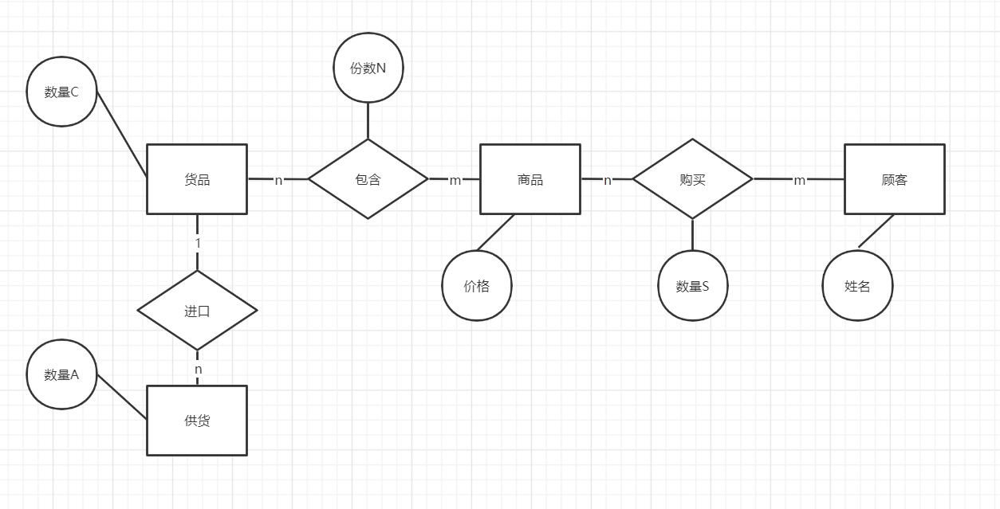

### 超市信息管理系统

对于几个、多个商品：

- 顾客在登录后购买
- 顾客未登录下购买的区别

购买行为：使商品被标记卖走

### 实体

#### 商品 

属性：

- 从哪里来，现在的数量，商品的去向

#### 资金账单

属性：

- 时间，交易明细，收款，余额

---

不设账单

## 目录

[TOC]


### 需求分析

- 超市里有各色商品，同一类商品按品牌标价，所有商品都按单价出售。

- 顾客进入商店后，可以查看商品，购买商品，查看以往记录。

- 超市管理员，可以为商品定价，查看以往的定价情况，同时撤除一些商品，查看撤除的商品，从外进口一些商品，查看商品进口的情况。

#### 详细描述

商品作为一个实体，其数量主要指正在出售的数量，即商品的总数，设为C。

每种商品进口时的数量，累加后是商品的最初数量，设为A。

商品被顾客购买的数量，累加后设为S。

则有， A = C + S

超市管理员查看商品，即看它当前的数量，总进口的数量和总出售的数量。

超市管理员撤除商品，仅减少它当前的数量。

超市管理员进口商品，增加A，和C。

#### 价格问题

因为顾客购买商品，直接按标价，超市管理员在进口商品时，只论数量，价格只是商品的一个可变属性。

而当超市采用多种营销模式，出售商品时，价格就独立于商品。价格和多个商品，甚至客户关联。


| 商品1 | 商品2 | 商品3 | 商品4 | 价格 |
| :---- | :---- | ----- | ----- | ---- |
| 1     | 0     | 0     | 0     | ￥   |
| 0     | 1     | 0     | 0     | ￥   |
| 0     | 2     | 0     | 0     | ￥   |
| 0     | 2     | 1     | 1     | ￥   |
|       |       |       |       |      |

Er图上的含义： 


**原来的商品，去掉价值属性后，变成了货品。**

一种货品会被包装在不同的商品中

一种商品可能含有多个，多种货品。

**份数：一种商品包含某货品的数量。**设为N

商品只有种类，**没有数量。**


### 概念模型

#### 纠正后

原来商品被购买的数量：S

现在是货品的集合，商品的销售数量。S



---

#### 增设

> 超市管理员撤除商品，仅减少它当前的数量。

即商品（指货品，下同）还有一个去向，反映在它的数量一致性上。

撤除，即遗弃。

一个商品可以有多次遗弃，一次遗弃记录了某一商品什么时候遗弃，撤下了多少。


#### 第三去向

遗弃，货品直接被指认不再使用。

上处的遗弃，实际是撤下。

纠正后：

- 遗弃通过伪删除标志
- 撤下是记录remove表。

需求上：

- 撤下不用遗弃，仍可见。
- 遗弃后不可见，消失。
- 遗弃一定记录，全数撤除。

### 关系模式

货品（**货品ID**，名称，类型，数量C） 

商品（**商品ID**，商品名称，价格）  

顾客（**顾客ID**，姓名，密码，VIP） 

---

供货（**供货ID**，*货品外键*，进口时间，数量A）

包含（***货品外键，商品外键***，份数N）

购买（**购买ID**，*商品外键，顾客外键*，购买日期，数量S）

撤除（**撤除ID**，*货品外键*，撤除时间，数量O）

---

#### 属性

包含和购买，都是为了多对多的联系而独立出的实体。

包含和购买的属性，前者只记录：某商品含有某货品多少。后者要记录：某顾客在某一次，购买了某商品多少。

购买的实体完整性，涉及到了某一次活动，可设置次数的属性。但这里直接用：物理ID区分前后。


### 建表SQL Server

- create 模式
- 完整性——实体，参照，主外键
- 属性上约束——数据类型，非空，可空，唯一，取值check

#### 笔记

##### SQL Server Manager 使用

[(31条消息) SQLserver——Sqlserver的使用_ZoJane的博客-CSDN博客_sqlserver使用](https://blog.csdn.net/qq_35706707/article/details/102527735)

[SQLServer 不允许保存更改错误解决办法 - springsnow - 博客园 (cnblogs.com)](https://www.cnblogs.com/springsnow/p/13219909.html)

软件的操作，sql的写法：

##### 主键自增

[SQLServer数据库添加主键和主键自增-百度经验 (baidu.com)](https://jingyan.baidu.com/article/91f5db1b11dda21c7f05e3d3.html)

可以间主键自增，在MSSM里叫：标识、增量、种子

##### 设置unique

[sqlserver表的唯一键约束怎么设置？_百度知道 (baidu.com)](https://zhidao.baidu.com/question/42497731.html)

可以给两个、多个属性类加：unique(  , ...)

```sql
alter table goods
add constraint C2 unique(goods_name,goods_type)
```

测试结果

+

---

##### 约束、设置外键

[(31条消息) SqlServer基础：约束_weixin_30407099的博客-CSDN博客](https://blog.csdn.net/weixin_30407099/article/details/98411748)

[(31条消息) SQL server 外键约束操作_烟敛寒林的博客-CSDN博客_sqlserver外键约束怎么写](https://blog.csdn.net/dyw_666666/article/details/88794126)

注意设置外键 —— 参照完整性？级联删除：不执行删除


### 关系模式 - 细节

#### 实体

##### 货品

货品（**货品ID**，名称，类型，数量C） 

> goods(goods_id, goods_name, goods_type, number_c, logout)

- goods_id：主键，整型，自增
- （goods_name, goods_type）：唯一，varchar，引索
- number_c：整型
- logout：整型，默认0，check(0,1)
  0. 货品正常和买完
  1. 撤下伪删除

##### 商品

商品（**商品ID**，商品名称，价格，删除标志）

> sale(sale_id, sale_name, sale_price, sale_pid, logout)

- sale_id：主键，整型，自增

- sale_name：不唯一，varchar

- sale_price：小数，decimal，check(>=0)

- logout：整型，默认0，check(0,1)

  1：下架伪删除

- sale_pid：参照sale_id主键，可空。

  - 设计
    - 直接参照新代商品id，一对多模式。
    - 不用一对一，因为迭代更新次序，可通过物理自增id反映。
    - sale_pid不为空时是迭代品，迭代品一定下架。
    - check【(sale_pid is null ) or ( (sale_pid is not null ) and ( logout = 1 ) )】
  - 约束
    - sale_pid依赖sale_id
    - sale_pid可以是null
    - 被依赖的商品的sale_pid==null
    - sale_pid非空的商品，其logout==1
  - 实现（对应上面）
    - 外键：sale_pid参照sale_id
    - 默认：null
    - *无法实现*，**只能在sql更改时检查，可以抛异常**
    - check语句


##### 顾客


顾客（**顾客ID**，姓名，密码，VIP，删除标志） 

> customer(customer_id, customer_name，customer_pwd, customer_vip, logout)

- customer_id：主键，整型，自增
- customer_name：唯一，varchar
- customer_pwd：非空，varchar，check(len(?) = 6)
- customer_vip：整型，默认0，check(0~3)
- logout：整型，默认0，check(0,1)


#### 联系

##### 供货

供货（**供货ID**，*货品外键*，进口时间，数量A）

>  import(import_id, goods_id, import_date, number_a)

- import_id：主键，整型，自增
- goods_id：外键，整型，foreign key (?) reference goods(?)
- import_date：日期到秒，datetime，可空
- number_a：整型

##### 包含

包含（***货品外键，商品外键***，份数N）

> makeup(goods_id, sale_id, number_n)

- goods_id：外键，整型，reference goods(?)
- sale_id：外键，整型，reference sale(?)
- (goods_id, sale_id)：主键
- number_n：整型

##### 购买

购买（**购买ID**，*商品外键，顾客外键*，购买日期，数量S）

> purchase(purchase_id, sale_id, customer_id, customer_date, number_s)

- purchase_id：主键，整型，自增
- sale_id：外键，整型，reference goods(?)
- customer_id：外键，整型，reference customer(?)
- purchase_date：可空，datetime
- number_s：整型

##### 撤除

撤除（**撤除ID**，*货品外键*，撤除时间，数量O）

> remove(remove_id, goods_id, remove_date, number_o)

- remove_id：主键，整型，自增
- goods_id：外键，整型，reference goods(?)
- remove_date：日期到秒，datetime，可空
- number_o：整型


#### 一系类改动

第一次：

第二次：顾客密码

第三次：伪删除，货品数量C

第四次：商品修改，和下架两种伪删除

第五次：购买记录增加日期

第六次：货品加logout换C，做伪删除

第七次：商品增加pid，下架变回一种。

第八次：购买的goods_id应该为sale_id，其外键也有问题。


#### 更新时间：2021/12/31

**持续更新中**


## 疑问

## 考虑商品，是否增加售完标识？

在将临时类。

数据再次处理靠定义新类完成。

新类可封装原来的实体类。原类的转换，新类的创建可依靠工厂模式。


#### 补充知识

中午时，得到的建议，在项目中用到，数据库概论上不讲。

> - 不必设置外键
> - 物理ID作为主键，逻辑ID作为唯一标识。方便查找？
> - 不要delete记录，伪删除！


#### 伪删除 ：

伪删除的必要。

举例：

如果某种货品被全部撤除，它被表中消失，则参照它级联实体都会出错。

所以撤除、购买行为让货品数量C变为0时，不移除该商品，用0做伪删除。

之后的查表，会看到该种货品数量为0，商品判断未缺货，顾客购买记录不影响。

##### 1.顾客

顾客的伪删除，顾客实体增加属性：注销状态  。

**设删除标志属性**

> off：0，正常，1，已注销。

##### 2.商品

商品同样不能直接删除，因为会影响购买记录。

同时，商品组合方式修改，等于新增一种商品，伪删除原来的商品，购买记录不变。

**设删除标志属性**

> off：0，正常，1，已注销。

***具体看关系模式 - 细节***

###### 增加

商品被取代的现上架商品。

被取代的商品一定下架，它将拥有一个 **现使用商品的id。**

主动下架的商品，即停止更新，不再有 **现使用商品的id。**

- 现使用商品的id，主要是为了 获取一个商品更新组。

- 现使用商品，即更新组中为首的商品，无论是否下架。
  - 它的**现使用商品的id** 为无。
  - 新代：现使用商品，无论是否下架。
  - 迭代：现使用商品关联的，已被取代的商品，一定已下架。
- *目前的关系模式无法将商品更新组关联*


##### 3.货品

货品伪删除，是将其数量C 变为0。

**也使用标志**


#### 新增需求

##### 分析

已注销的顾客，不能再登录。

但仍保留着：它唯一的名称，它的vip等级。

直到超市管理员，取消该顾客的注销。


伪删除的商品，仍在顾客的购买记录中可见。

陈列的是替换后的商品，新的商品id。


### 连接数据库

驱动，connect，statement，sql

#### 导入jar包

[(31条消息) add as library是什么？有什么用？如何打开？_doubleguy的博客-CSDN博客_add as library](https://blog.csdn.net/doubleguy/article/details/104947149)

#### ……

#### 截图


#### SQL实现方法

返回问题。

原则：

- 实体类不存在，返回null。
- List<实体类>无元素，返回list的初始态。
- 实体类不存在，不能返回初始态。

#### 多对多的数据

问题：顾客-商品，商品-货品。完整的全引用载入非常困难。

##### 策略

SQL层方法，只提供一对多式的单引用输出。

##### 分析

前端的界面上，树形显示，限制：前可操作后，后只用来显示。
